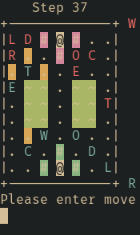

<div align="center">

<h1>jungle-rs</h1>

_A simple emulator for the Jungle board game,
using Rust and the MVC pattern_



</div>

## Quick start

If you haven't installed Rust, a programming language,
please see below for a simple guide,
or refer to the [official guide](https://www.rust-lang.org/tools/install).

Clone this repository and run `jungle-rs`:

```bash
git clone https://github.com/mhho3082/jungle-rs --depth 1

cd jungle-rs

cargo run
```

This will take quite some time to compile (mainly the libraries) for the first time,
then it should run the game smoothly.

Add `--` before this application's flags to use them:

```bash
cargo run -- -a naive-defensive -d # debug mode with AI
```

To get a list of options:

```bash
cargo run -- -h
```

## How to play

Please play in a terminal emulator that supports `truecolor`,
or at least ANSI escape sequences; else you will see a lot of
weird inputs and errors.

It is advised that you play with your terminal emulator
running in "dark mode" of some sort, i.e.,
your background is dark, and your text is white by default.

On the board, the pieces are labelled as their short forms.
The short form is the name's first letter, except for leopard,
which has a short form of `O`. They are labelled by their colour,
blue or red.

The rivers are marked with a background of green,
the traps are marked light blue and light red,
and the dens are marked white (or your text colour).
When pieces step on these special squares, the background
changes to their piece colour instead.

To move, select a piece by their short form (refer to the board itself)
(or their full English name),
then press <kbd>Enter</kbd>. (Case does not matter)
Then, all the allowed moves will be highlighted in yellow.
Press one of `wasd` (up, left, down, right),
or one of `hjkl` (left, down, up, right),
then <kbd>Enter</kbd>, to make the move. (Again, case does not matter)

For debug mode, time travel, and more,
please refer to the game prompts.

_Note: Why `[hjkl]`?_
It comes from Vi(m) as the primary arrow keys.
I use Neovim, so I find it rather ergonomic for me.

## How to install Rust

For Linux and macOS users,
installing stable Rust through `rustup` is recommended:

```bash
curl --proto '=https' --tlsv1.2 -sSf https://sh.rustup.rs | sh
```

Or, even better, please use your OS's package manager,
such as `yay` or `homebrew`,
to install `rustup`, then use `rustup` to install the stable toolchain:

```bash
rustup toolchain install stable
```

For Windows users, please refer to the
[official guide](https://www.rust-lang.org/tools/install).

## Libraries (crates) used

- `clap`: For simplified CLI arguments
- `colored`: To easily colour TUI text
- `rand`: For randomization for AI

## References

This application is made in anticipation for a course project
at the Polytechnic University of Hong Kong,
referring to the COMP3211 project requirements;
the actual project is written in Java instead.

I have learnt basic Rust all on my own,
referring to online guides such as
[the Rust Book](https://doc.rust-lang.org/book/)
and [the Cargo Book](https://doc.rust-lang.org/cargo/).
I am currently continuing my journey to learn Rust,
and exploring how I may use this amazing tool in various opportunities.
